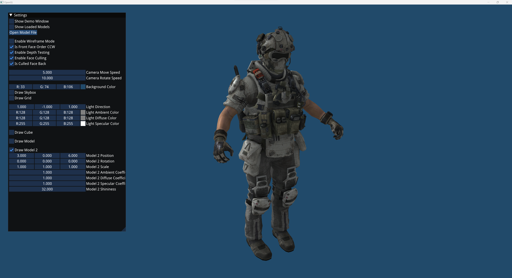

# OpenGL Model Viewer

This is my project for my game engine course at Southern New Hampshire University. This application allows you to view .obj models and (still WIP) .fbx models.

Note: The de_dust 2 and IMC grunt models are not included in this project since they are copyrighted. I extracted them from game files and used them for testing model loading.

